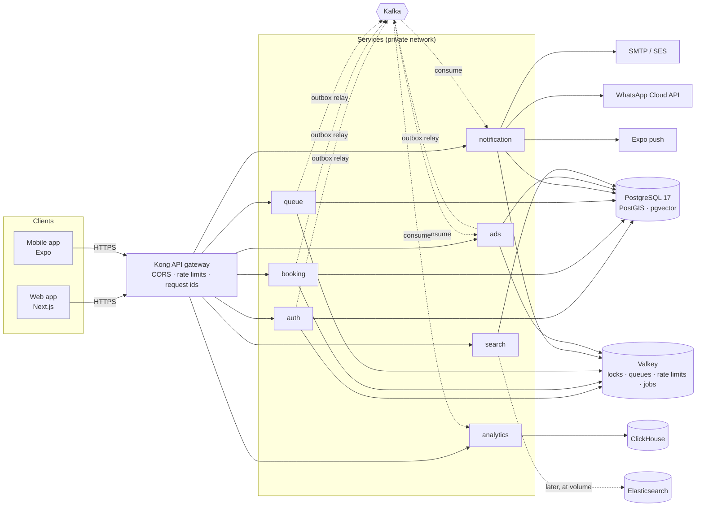
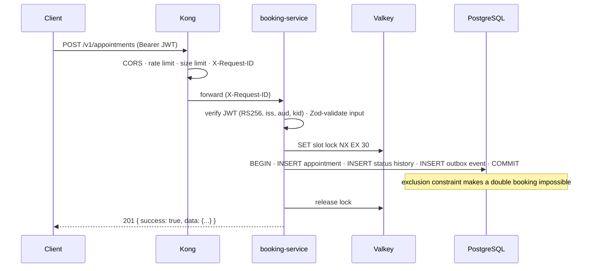
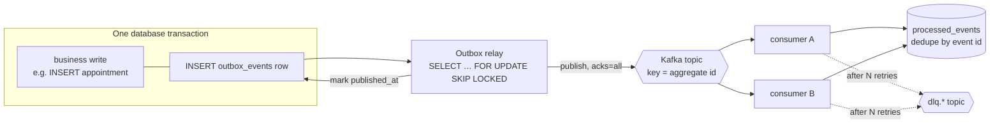

# Architecture

BUKU is a two-sided marketplace: consumers book appointments or join virtual
queues; businesses run their schedule from a dashboard. The backend is a set
of small TypeScript services behind one API gateway, sharing one PostgreSQL
database (each table owned by exactly one service) and talking to each other
through **events on Kafka**, never through each other's tables.

## System overview



| Component              | Role                                              | Why this choice                                                         |
| ---------------------- | ------------------------------------------------- | ----------------------------------------------------------------------- |
| Kong 3.9 (DB-less)     | Single public entry point                         | Declarative config in git; the services never face the internet         |
| Node.js 24 + Express 5 | Service runtime                                   | LTS; Express 5 forwards async errors to the error handler               |
| PostgreSQL 17          | System of record                                  | Transactions + constraints give correctness guarantees code alone can't |
| Valkey 8               | Locks, live queue state, rate limits, BullMQ jobs | Redis-compatible; what DigitalOcean's managed cache runs                |
| Kafka 4.3 (KRaft)      | Event backbone                                    | Durable, ordered per key, replayable; decouples services                |
| Elasticsearch 9        | Discovery search, later (D-076)                   | Only when volume needs it; Postgres full text + PostGIS until then      |
| ClickHouse 26.3 LTS    | Analytics                                         | Columnar OLAP: dashboard aggregates over millions of rows in ms         |

## A request, end to end



Every response is one of two envelopes:
`{ "success": true, "data": …, "meta"?: … }` or
`{ "success": false, "error": { "code", "message", "details"?, "requestId" } }`.
Clients branch on `error.code` (see `packages/common/src/errors.ts`), never on messages.

## Events: the transactional outbox



- **No lost events:** the event row commits atomically with the business change.
- **Ordered per aggregate:** the Kafka key is the aggregate id (e.g. appointment id), and only one
  relay publishes at a time (advisory lock).
- **At-least-once:** consumers must be idempotent → `processOnce(db, consumer, event.id, fn)`.
- **Poison messages don't block:** retries with backoff, then the dead-letter topic.

Envelope (all topics): `id, type, version, source, occurredAt, subject, correlationId?, data`.

## Data model highlights

- 35 tables (34 Prisma-managed in `public`, plus `ai.business_knowledge_chunks` for pgvector).
- **UUIDv7** primary keys: time-ordered (fast inserts), unguessable, shard-friendly.
- **Integrity in the database:** exclusion constraints (staff and resources can't be double-booked),
  60+ CHECK constraints, partial unique indexes (one live queue ticket per user), foreign keys.
- **Derived data by trigger:** PostGIS `location` from lat/lng, weighted full-text `search_vector`
  (name, category and service names, description, city — recomputed when a service changes),
  `avg_rating`/`review_count` from visible reviews, `updated_at`.
- **Partitioning:** `audit_logs`, `notifications`, `ad_events` are range-partitioned by month
  (partitions live in the `partitions` schema). Old months are detached, not deleted row by row.
- **PII:** user email/phone stored AES-256-GCM encrypted + HMAC blind index for lookups.

Schemas: `public` (Prisma), `partitions` (monthly partitions), `ai` (vector store),
`extensions` (PostGIS, pgvector, pg_trgm, btree_gist, pgcrypto, uuid-ossp).

## Service ownership

| Service                | Owns (writes)                                                                                                                                      | Publishes                                                            | Consumes                                                           |
| ---------------------- | -------------------------------------------------------------------------------------------------------------------------------------------------- | -------------------------------------------------------------------- | ------------------------------------------------------------------ |
| auth                   | users (incl. employee accounts, private profile pictures), oauth_accounts, refresh_tokens, push_tokens, notification_preferences, business_members | `users.*`, `businesses.member_removed`                               | —                                                                  |
| business               | businesses (+ legal profile), hours, photos, logo, staff photos, documents, reviews, favourites                                                    | `businesses.*`                                                       | `businesses.member_removed`                                        |
| booking                | service categories, services, staff profiles ↔ services, working hours, time off, booking settings, appointments, status history, staff attendance | `bookings.created/confirmed/cancelled/rescheduled/completed/no_show` | `bookings.completed`, `businesses.member_removed`, `users.deleted` |
| queue                  | queue_settings, queue_sessions, queue_entries                                                                                                      | `queue.*`                                                            | `users.deleted`                                                    |
| billing                | plans, plan_prices, billing_settings, subscriptions, cost items, channel fees (entitlements via `@buku/billing`)                                   | `payments.*`                                                         | `bookings.created`, `queue.entry.joined`                           |
| notification           | notifications (inbox + delivery records), notification preferences; consumes `bookings.*`, `queue.*`; later webhooks                               | `notifications.delivered`                                            | `bookings.*`, `queue.*`, `users.*`                                 |
| search                 | business_search_stats (ranking figures); reads businesses, services, hours, queues live from Postgres (D-076)                                      | `analytics.search`                                                   | —                                                                  |
| ads _(deferred)_       | business_ads, ad_events                                                                                                                            | `analytics.ad.impressions`                                           | `bookings.created`                                                 |
| analytics _(deferred)_ | ClickHouse tables                                                                                                                                  | —                                                                    | `analytics.*`, `bookings.*`, `queue.session.closed`                |

**Authorization across services:** every service resolves a user's role in a business with the
shared read-only helper `requireBusinessPermission()` (owner from `businesses.owner_id`, others
from `business_members`), checked against the single permission table in `@buku/common`.

auth-service's data export reads the other services' tables read-only (GDPR aggregation, D-043);
no service ever writes another service's tables.

Deferred services keep their code and configuration but run only with their compose profile
(`--profile ads`, `--profile analytics`, `--profile elasticsearch`).

## Repository map

```
packages/common     errors, config, logging, validation, security primitives, HTTP app + server
packages/database   Prisma schema, migrations (incl. hand-written SQL), client, seed
packages/kafka      topic registry, envelope, producer, consumer, outbox, idempotency
services/*          7 services (Phase 1: skeleton + readiness; Phase 2: business logic)
docker/             dev image, production image, Postgres image (PostGIS + pgvector + roles)
infrastructure/     Kong, Elasticsearch, ClickHouse, S3 bootstrap
scripts/            bootstrap, health check, Phase 1 verification, GitHub branch protection
docs/               this documentation
```
